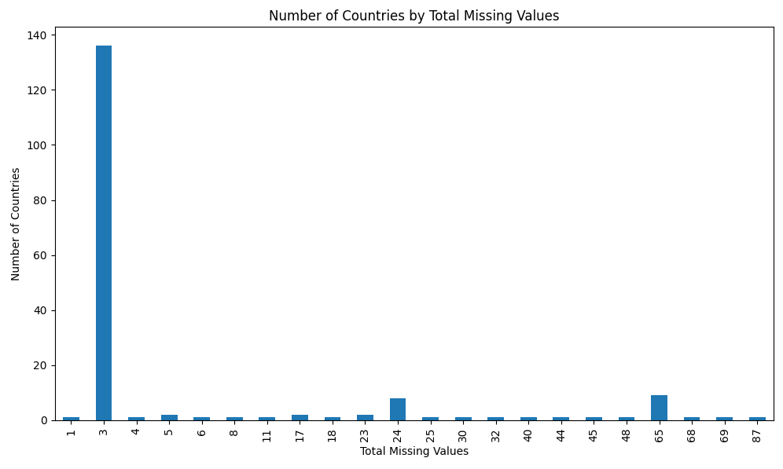
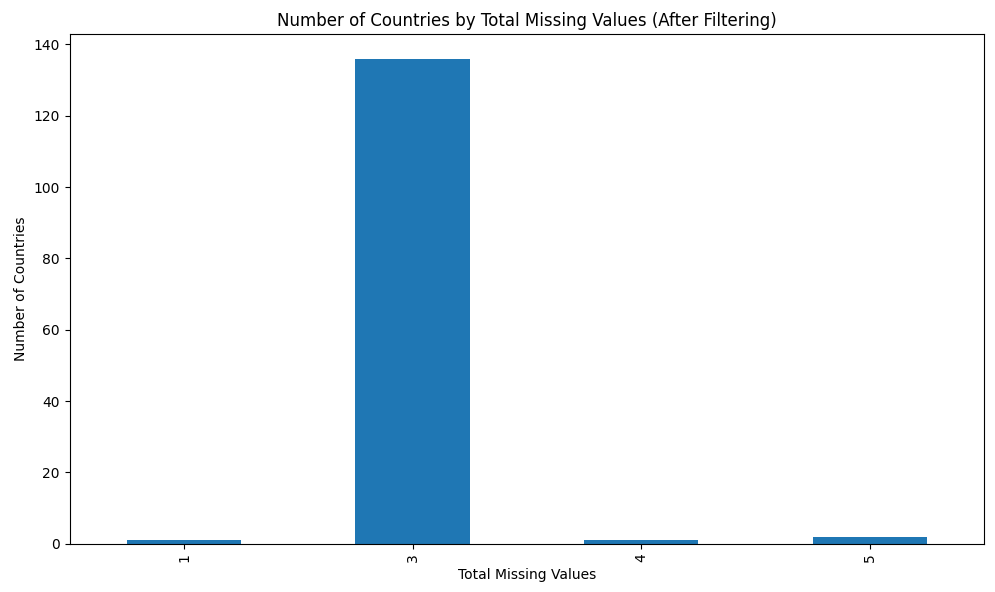
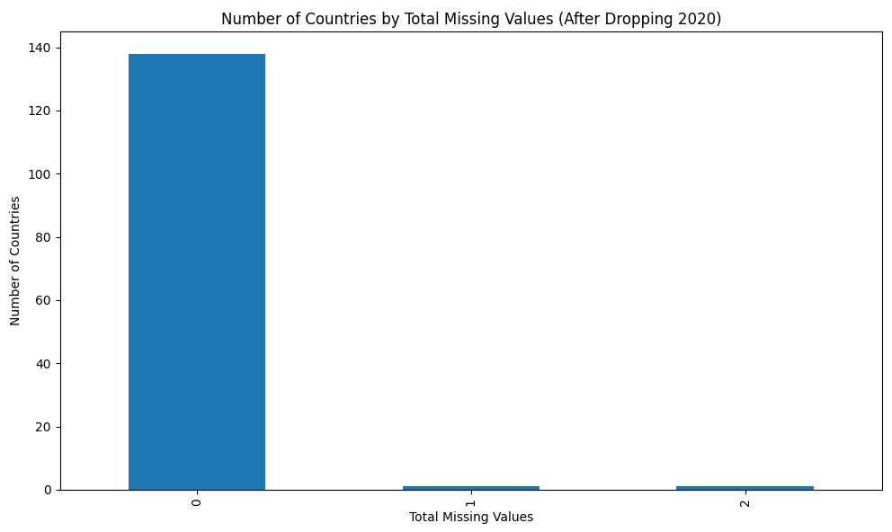
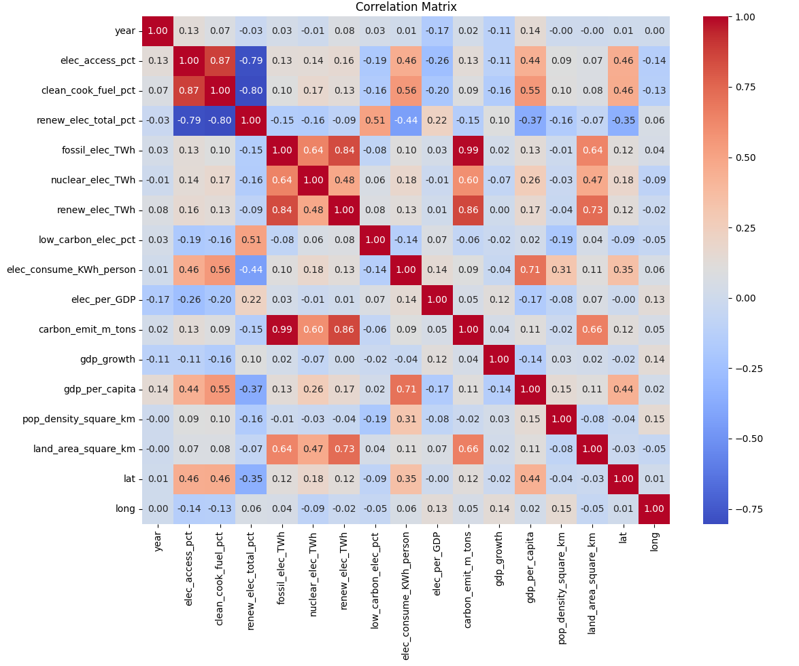
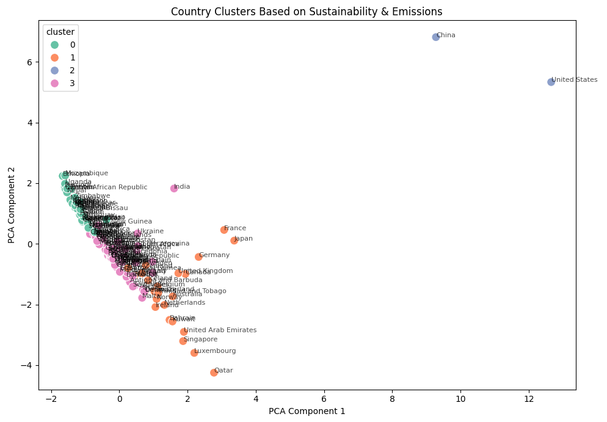
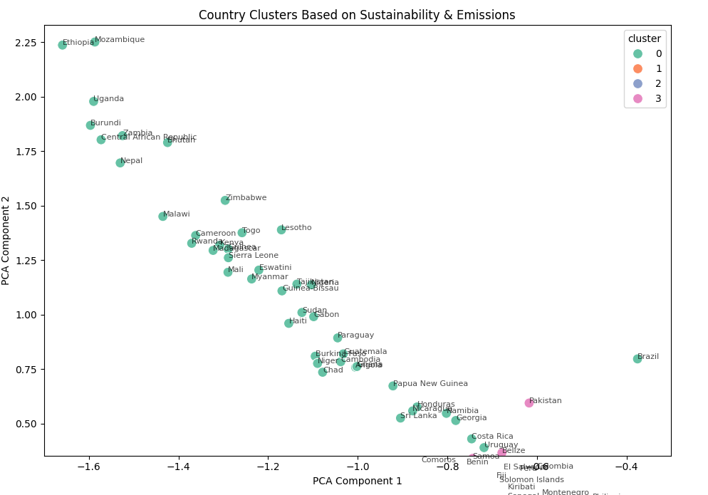
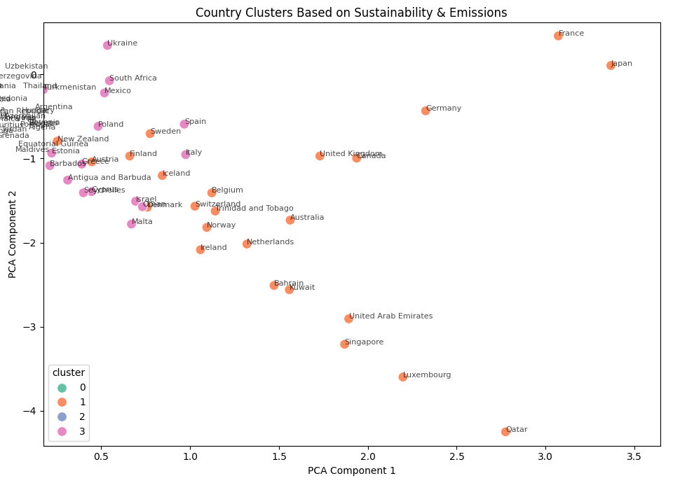
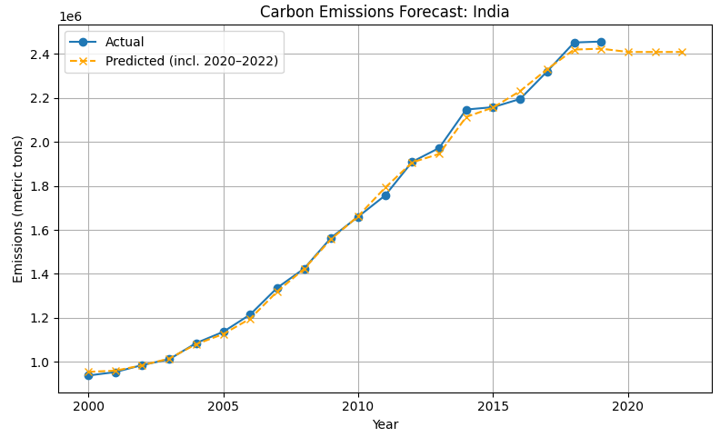
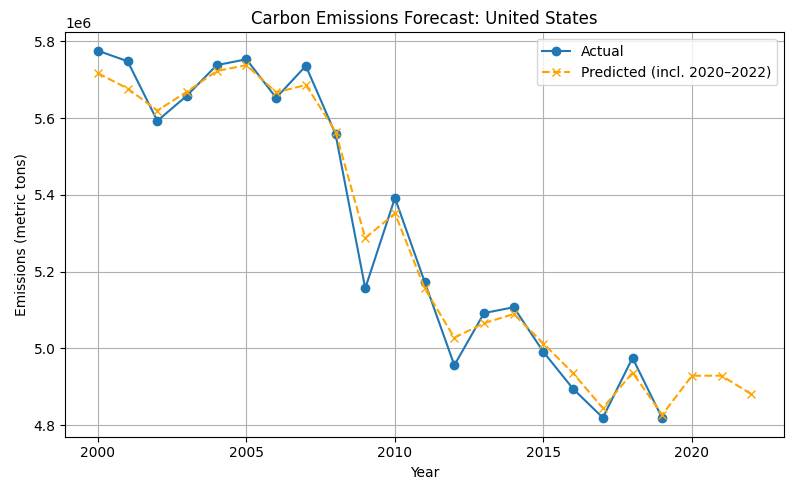
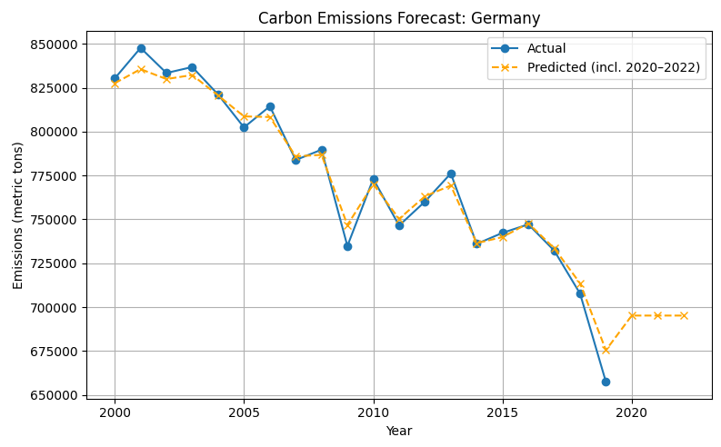

# Countries-and-World-Ending-Sustainability
How can I help save the world from "the Others"

Data: "Uncover this dataset showcasing sustainable energy indicators and other useful factors across all countries from 2000 to 2020. Dive into vital aspects such as electricity access, renewable energy, carbon emissions, energy intensity, Financial flows, and economic growth. Compare nations, track progress towards Sustainable Development Goal 7, and gain profound insights into global energy consumption patterns over time." - [Kaggle: Global Data on Sustainability Energy](https://www.kaggle.com/datasets/anshtanwar/global-data-on-sustainable-energy)

This dataset includes data about sustainable engery for countries from 2000-2020. 

| Feature                                                          | Description                                                                                | Renamed Feature |
| ---------------------------------------------------------------- | ------------------------------------------------------------------------------------------ | ---------------------------------------------------------------- |
| Entity                                                           | The name of the country or region for which the data is reported.                          | country |
| Year                                                             | The year for which the data is reported, ranging from 2000 to 2020.                        | year |
| Access to electricity (% of population)                          | The percentage of population with access to electricity.                                   | elec_access_pct |
| Access to clean fuels for cooking                                | The percentage of the population with primary reliance on clean fuels.                     | clean_cook_fuel_pct |
| Renewable-electricity-generating-capacity-per-capita             | Installed Renewable energy capacity per person.                                            | renew_elec_person |
| Financial flows to developing countries (US $)                   | Aid and assistance from developed countries for clean energy projects.                     | finance_assist |
| Renewable energy share in the total final energy consumption (%) | Percentage of renewable energy in final energy consumption.                                | renew_elec_total_pct |
| Electricity from fossil fuels (TWh)                              | Electricity generated from fossil fuels (coal, oil, gas) in terawatt-hours.                | fossil_elec_TWh |
| Electricity from nuclear (TWh)                                   | Electricity generated from nuclear power in terawatt-hours.                                | nuclear_elec_TWh |
| Electricity from renewables (TWh)                                | Electricity generated from renewable sources (hydro, solar, wind, etc.) in terawatt-hours. | renew_elec_TWh |
| Low-carbon electricity (% electricity)                           | Percentage of electricity from low-carbon sources (nuclear and renewables).                | low_carbon_elec_pct |
| Primary energy consumption per capita (kWh/person)               | Energy consumption per person in kilowatt-hours.                                           | elec_consume_KWh_person
| Energy intensity level of primary energy (MJ/$2017 PPP GDP)      | Energy use per unit of GDP at purchasing power parity.                                     | elec_per_GDP | 
| Value_co2_emissions_kt_by_country                                | Carbon dioxide emissions per person in metric tons.                                        | carbon_emit_m_tons |
| Renewables (% equivalent primary energy)                         | Equivalent primary energy that is derived from renewable sources.                          | primary_elec_equiv_to_renew |
| gdp_growth                                                       | Annual GDP growth rate based on constant local currency.                                   | gdp_growth |
| gdp_per_capita                                                   | Gross domestic product per person.                                                         | gdp_per_capita |
| Density\n(P/Km2)                                                | Population density in persons per square kilometer.                                        | pop_density_square_km |
| Land Area(Km2)                                                   | Total land area in square kilometers.                                                      | land_area_square_km |
| Latitude                                                         | Latitude of the country's centroid in decimal degrees.                                     | lat |
| Longitude                                                        | Longitude of the country's centroid in decimal degrees.                                    | long |

## Challenges

There are many values missing (nulls) for many features. From what I can tell, it could be a country missing all values for a specific feature, or missing values for a given year. To handle this I will figure out what features are important to my problem and also how to fill missing values.


<br/>*Number of null per feature.*


<br/>*Correlation matrix of variable after naively removing nulls (temporary).*

## Cleaning the data

1. pop_density_square_km column values were strings when they should have been a numerical value. <br/>

```
globe_sustain['pop_density_square_km'] = (
    globe_sustain['pop_density_square_km']
    .str.replace(',', '', regex=False)
    .astype(float)
)
```

2. The data is incredibly sparse for renew_elec_person, finance_assist, and primary_elec_equiv_to_renew. I decided that these columns aren't too important for my task and they would be very difficult to fill while keeping the data's integrity. <br/>

```
cols_to_drop = [ 'finance_assist', 'primary_elec_equiv_to_renew', 'renew_elec_person']
globe_sustain.drop(columns=cols_to_drop, inplace=True)
```

3. I removed countries that were missing all lat and long values for every year which was only French Guiana.<br/>

```
countries_to_drop = globe_sustain.groupby('country')[['lat', 'long']].apply(
    lambda df: df.isnull().all().any()
)
globe_sustain = globe_sustain[~globe_sustain['country'].isin(countries_to_drop[countries_to_drop].index)]
```

4. Dropped countries that had an excessive amount of missing values as seen in the following figures. I decided that any country missing more than 5 would be removed. I also noticed that almost every country was missing 3 values. I discovered that it was the year 2020 missing gdp_growth and two others. I decided to remove the year 2020 for all countries.<br/>


<br/>*Number of countries by total missing values before filtering*

```
missing_by_country = globe_sustain.groupby('country').apply(lambda group: group.isnull().sum())
total_missing_per_country = missing_by_country.sum(axis=1).sort_values(ascending=False)
print(total_missing_per_country.head(10))

high_null_countries = total_missing_per_country[total_missing_per_country > 5].index
globe_sustain = globe_sustain[~globe_sustain['country'].isin(high_null_countries)]
```


<br/>*Number of countries by total missing values after filtering*

```
globe_sustain = globe_sustain[globe_sustain['year'] != 2020]
```


<br/>*Number of countries by total missing values after removing 2020*

5. Qatar was missing 1 value and Guinea-Bissau was missing 2. I used the mean of the missing value column for that country to fill.<br/>

```
Top 10 countries by total missing values after dropping 2020:
country
Guinea-Bissau    2
Qatar            1
Algeria          0
Angola           0
Armenia          0
Australia        0
Austria          0
Azerbaijan       0
Bahrain          0
Bangladesh       0
```

<br/>

```
countries_to_fill = ['Guinea-Bissau', 'Qatar']
for country in countries_to_fill:
    country_mask = globe_sustain['country'] == country
    for col in globe_sustain.columns:
        if globe_sustain[col].dtype in ['float64', 'int64'] and col != 'year':
            mean_val = globe_sustain.loc[country_mask, col].mean()
            globe_sustain.loc[country_mask, col] = globe_sustain.loc[country_mask, col].fillna(mean_val)
```


<br/>*Correlation matrix of variable after cleaning the data and retaining data integrity*

## Clustering

I chose to cluster by these 8 features to see what certain countries may be categorized as.

1. Renewables %
2. Fossil TWh
3. Nuclear TWh
4. Elec per GDP
5. GDP per Capita
6. Elec/Person (kWh)
7. Low Carbon Elec %
8. CO₂ Emissions (tons)


<br/>*Countries clusters based off 8 features*


<br/>*Cluster 0*


<br/>*Cluster 1*


<br/>*Cluster 2*


<br/>*Cluster 3*

This table shows the aggregated values for the clusters for each feature. 

| Cluster | Description | Renewables % | Fossil TWh | Nuclear TWh | Elec per GDP | GDP per Capita | Elec/Person (kWh) | Low Carbon Elec % | CO₂ Emissions (tons) |
| ---------------------------------------------------------------- | ------------------------------------------------------------------------------------------ | ---------------------------------------------------------------- | ---------------------------------------------------------------- | ---------------------------------------------------------------- | ---------------------------------------------------------------- | ---------------------------------------------------------------- | ---------------------------------------------------------------- | ---------------------------------------------------------------- | ---------------------------------------------------------------- |
| 0 | Low Emission, Low GDP, High Renewables | 71.60 | 3.03 | 0.30 | 6.52 | 1,952.57 | 4,326.20 | 64.95 | 16,412 |
| 1 | Wealthy Balanced Energy Users | 16.63 | 91.63 | 43.41 | 5.56 | 46,117.99 | 88,740.15 | 43.29 | 196,325 |
| 2 | Mega Emitters (US/China) | 12.00 | 2,949.08 | 451.39 | 7.19 | 27,098.10 | 52,392.14 | 26.69 | 6,483,090 |
| 3 | Developing, Fossil-Reliant | 19.73 | 39.93 | 3.48 | 4.61 | 7,939.01 | 18,861.60 | 23.80 | 83,755 |

Since there are 8 features, I had to reduce the dimensionality to view on a map. To achieve this, I used [sklearn principle component analysis](https://scikit-learn.org/stable/modules/generated/sklearn.decomposition.PCA.html). This made it a little difficult to understand the map, but going to the right looks like it means higher emission, fossil fuel, and GDP. Going up looks like it may be more renewable energy.

```
Enter a country name (or type 'exit' to quit): China
🌍 China is: Mega Emitters (US/China)
Enter a country name (or type 'exit' to quit): Sri Lanka
🌍 Sri Lanka is: Low Emission, Low GDP, High Renewables
Enter a country name (or type 'exit' to quit): Mexico
🌍 Mexico is: Developing, Fossil-Reliant
Enter a country name (or type 'exit' to quit): India
🌍 India is: Developing, Fossil-Reliant
Enter a country name (or type 'exit' to quit): Japan
🌍 Japan is: Wealthy Balanced Energy Users
Enter a country name (or type 'exit' to quit): Germany
🌍 Germany is: Wealthy Balanced Energy Users
Enter a country name (or type 'exit' to quit): Cuba
🌍 Cuba is: Developing, Fossil-Reliant
Enter a country name (or type 'exit' to quit): exit
```

## Predictions

I predicted the emissions for each country for 2020, 2021, and 2022 (3 years). I did this because I wanted to use the predictions for a minigame of sorts. Using the prediction, I will see what country will be the last country standing, in the scenario that "the others" are eliminating the highest carbon emitted countries. To achieve the prediction. I first started with a linear prediction, but it was inaccurately representing the possible emissions. Then I moved on to a Random Forest Regressor model to handle any non-linearity. This predicted the emissions in a straight horizontal line at first, so I also projected the features to provide a more accurate prediction as seen in the following figures. 

<br/> The predictions can be found in [future_emission_predictions.csv](future_emission_predictions.csv)


<br/>*India emission prediction*


<br/>*US emission prediction*


<br/>*Germany emission prediction*

## Minigame: Last Country Standing

The Others are coming...

I used the 3 year predictions to create a minigame that simulates which countries you should visit to last the longest against "the others" as they eliminate countries with the highest carbon emissions (largely with the help of ChatGPT-4o). Since there are 52 weeks in a year and the "the others" are eliminating 1 country a week, 52 countries will be eliminated a year. There are 140 countries after removing the countries with sparse data, so it is possible to last at least just under 3 years by choosing the best country. The following is a list of the top 10 countries that lasted the longest.

```
Final 10 Countries Eliminated:
country                  week_eliminated
Solomon Islands          131
Guinea-Bissau            132
Grenada                  133
Samoa                    134
Dominica                 135
Comoros                  136
Vanuatu                  137
Central African Republic 138
Tonga                    139
Kiribati                 140
```


<br/> To last the longest go to one of these places and enjoy the beach while you can. 


