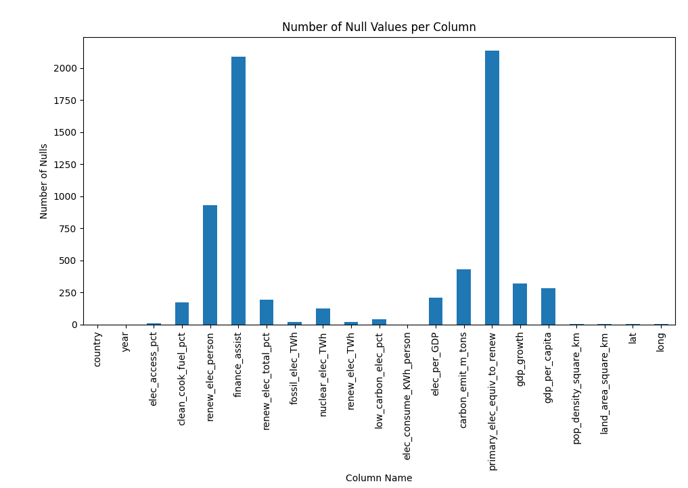
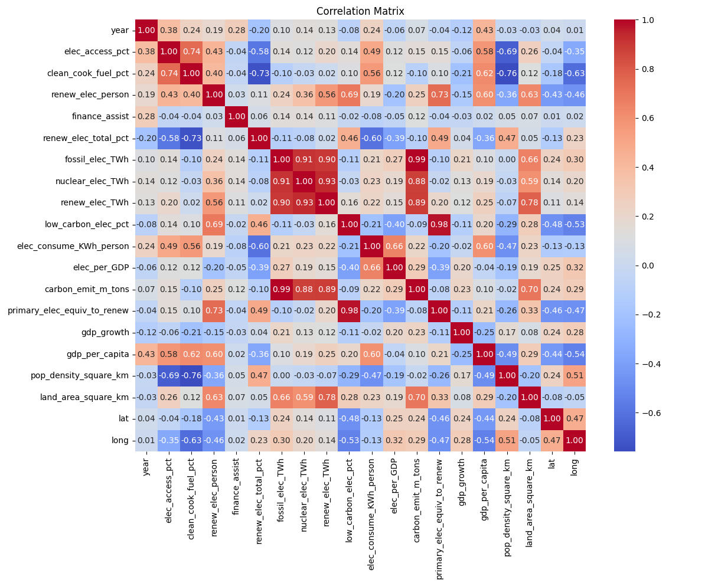

# Countries-and-World-Ending-Sustainability
CSCE A462 Data Mining Assignment 2. The goal is to discover how we can help save the world from "the Others"

Data: Uncover this dataset showcasing sustainable energy indicators and other useful factors across all countries from 2000 to 2020. Dive into vital aspects such as electricity access, renewable energy, carbon emissions, energy intensity, Financial flows, and economic growth. Compare nations, track progress towards Sustainable Development Goal 7, and gain profound insights into global energy consumption patterns over time.- [Kaggle: Global Data on Sustainability Energy](https://www.kaggle.com/datasets/anshtanwar/global-data-on-sustainable-energy)

This dataset includes data about sustainable engery for countries from 2000-2020. 

| Feature                                                          | Description                                                                                | Renamed Feature|
| ---------------------------------------------------------------- | ------------------------------------------------------------------------------------------ | ---------------------------------------------------------------- |
| Entity                                                           | The name of the country or region for which the data is reported.                          | country |
| Year                                                             | The year for which the data is reported, ranging from 2000 to 2020.                        | year |
| Access to electricity (% of population)                          | The percentage of population with access to electricity.                                   | elec_access_pct |
| Access to clean fuels for cooking                                | The percentage of the population with primary reliance on clean fuels.                     | clean_cook_fuel_pct |
| Renewable-electricity-generating-capacity-per-capita             | Installed Renewable energy capacity per person.                                            | renew_elec_person |
| Financial flows to developing countries (US $)                   | Aid and assistance from developed countries for clean energy projects.                     | finance_assist |
| Renewable energy share in the total final energy consumption (%) | Percentage of renewable energy in final energy consumption.                                | renew_elec_total_pct |
| Electricity from fossil fuels (TWh)                              | Electricity generated from fossil fuels (coal, oil, gas) in terawatt-hours.                | fossil_elec_TWh |
| Electricity from nuclear (TWh)                                   | Electricity generated from nuclear power in terawatt-hours.                                | nuclear_elec_TWh |
| Electricity from renewables (TWh)                                | Electricity generated from renewable sources (hydro, solar, wind, etc.) in terawatt-hours. | renew_elec_TWh |
| Low-carbon electricity (% electricity)                           | Percentage of electricity from low-carbon sources (nuclear and renewables).                | low_carbon_elec_pct |
| Primary energy consumption per capita (kWh/person)               | Energy consumption per person in kilowatt-hours.                                           | elec_consume_KWh_person
| Energy intensity level of primary energy (MJ/$2017 PPP GDP)      | Energy use per unit of GDP at purchasing power parity.                                     | elec_per_GDP | 
| Value_co2_emissions_kt_by_country                                | Carbon dioxide emissions per person in metric tons.                                        | carbon_emit_m_tons |
| Renewables (% equivalent primary energy)                         | Equivalent primary energy that is derived from renewable sources.                          | primary_elec_equiv_to_renew |
| gdp_growth                                                       | Annual GDP growth rate based on constant local currency.                                   | gdp_growth |
| gdp_per_capita                                                   | Gross domestic product per person.                                                         | gdp_per_capita |
| Density\n(P/Km2)                                                | Population density in persons per square kilometer.                                        | pop_density_square_km |
| Land Area(Km2)                                                   | Total land area in square kilometers.                                                      | land_area_square_km |
| Latitude                                                         | Latitude of the country's centroid in decimal degrees.                                     | lat |
| Longitude                                                        | Longitude of the country's centroid in decimal degrees.                                    | long |

## Challenges

There are many values missing (nulls) for many features. From what I can tell, it could be a country missing all values for a specific feature, or missing values for a given year. To handle this I will figure out what features are important to my problem and also how to fill missing values.

 Number of null per feature.

 Correlation matrix of variable after removing nulls (temporary).